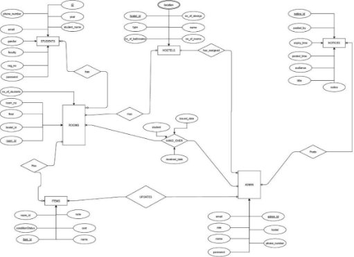
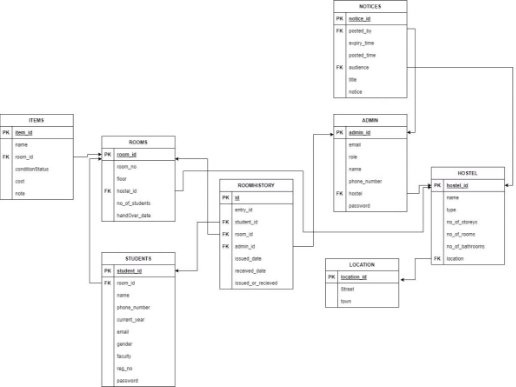
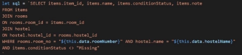
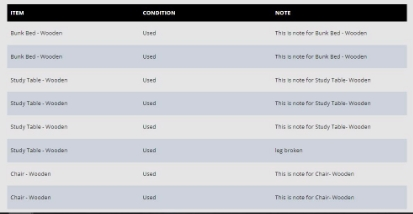
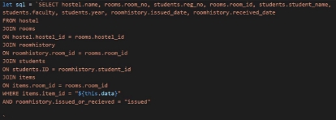
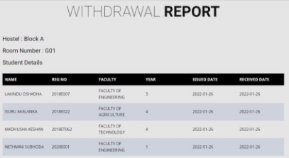
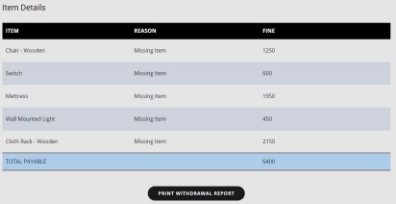

1. **PROBLEM STATEMENT** 
1. **OVERVIEW** 

In Sri Lanka, all the Government Universities manage hostel room details and the related student details manually causing lot of problems such as data losing, less efficiency, high handling time when hostel rooms are being handed over/delivered, less productivity of the hostel notice board, less efficiency in conveying the issues in hostel, inconvenience in paying hostel fees etc. 

The main scope of the project is to manage hostel room details when those are being handed over/delivered to the students and calculate fines accordingly in order to make the process more efficient and convenient for both parties, and also, to maintain the repairing history of every item in the hostel. In addition, posting a notice in the website is also included in the scope in order to increase the productivity and reach more students. Making a complain to the hostel administration, displaying hostel canteen prices and available stuffs in ongoing basis and paying hostel fees online through a payment gateway will be implemented later.

The primary success criteria is to deploy a website to manage hostel rooms and relevant student details when rooms are being handed over/delivered. 

2. **IN DETAIL** 

Till now, admission of the students to the hostel and taking back the rooms done by manually with paper works. It takes much time and efficiency is very low. Whenever hostel admin needs to find the student/ room details, it takes much time to go through the manual records. And also, notices are printed and displayed in the notice board. But the productivity is less and, it costs. Not only that, when the repairing person came to repair stuffs, he/ she should go to every room searching for any broken items. This consumes lot of time resulting extra cost. 

With this University Hostel Management system, hostel administration no needs to maintain any kind of paper works or records manually, saves lot of time. Whenever hostel admin needs to find the student/ room details, he/ she can search the relevant student or room to view details in just seconds from anywhere. E-notice board will allow to post a notice in the platform increasing the productivity and to reaching more students. With the new system, repairing person doesn’t need to go to every room searching broken items, he/she can go to precise room by searching through the website with the help of hostel administration. Finally, when students hand over the room back, the system finds the broken or missing items and displays the fine instantly. 

2. **FUNCTIONALITIES** 

The University Hostel Management website will be used in admitting the students in to the hostel and when the students handing over the rooms back. Students should register to the system with the email before they enter to the hostel.  

When the rooms are offered to the students, the warden/ sub-warden/ hostel admin can check current status of the available items in the room through the system and he/she can admit students to the relevant rooms.  

Details of a particular room can be obtained by the hostel administration through the system by searching the room. Whenever the items have been repaired, the room details can be updated. 

When students will hand over the room back, the hostel administration can update the room details. There is a report with all the information of missing and broken items with the total fine which is to be paid by the students. Then the rooms details are updated 

2. **FUTURE IMPLEMENTATIONS** 

In future, E-notice board, making a complain to the hostel administration, displaying hostel canteen prices and available stuffs in ongoing basis and paying hostel fees online through a payment gateway will be implemented. 

With these implementations, the students make complains to the hostel administration directly through the website to inform a burning issue inside the hostel. E-notice board will allow to post a notice in the platform increasing the productivity and to reaching more students. And also, the hostel canteen prices and available stuffs will be displayed in ongoing basis in the website. And students will be paying hostel fees online through the website instantly. So, the hostels management and the hostel life of students will become easier in future 

3. **KEY CHALLENGES FACED**  
- The main challenge that I have faced is the programming language to do the stuff with the server side. I choose NodeJS for programming language. I had to learn NodeJS up to a some extend in order to the project. 
- It was little bit harder to map the mini world scenario to the ER diagram because at the time I start to create ER diagram, there was no any reliable sources to get information about the Hostels. 
4. **DATABASE DESIGN** 

The database has total 8 tables. 

1. STUDENTS : Store the data of students 
1. ADMIN : Store the data of wardens/sub-wardens/ hostel admins 
1. HOSTEL : Store the data of hostels 
1. LOCATION : Store the data of the locations of the hostels 
1. NOTICES : Notice data is stored here. 
1. ROOMHISTORY : When receiving and issuing the rooms to students, a record of transaction is added here. 
1. ROOMS : Store the data of rooms 
1. ITEMS : Store the data of items in a room 
1. **ER DIAGRAM** 

2. **RELATION SCHEMA** 

5. **SAMPLE REPORTS WITH SQL QUERIES**  
1. **STUDENT AND ROOM DETAILS** 

SQL Query:  

 

` `Report:  

2. **ITEMS IN A ROOM**  SQL Query:  

Report: 

3. **STUDENT INFORMATION ON ROOM WITHDRAWAL**  SQL Query: 

Report: 

**5.4. FINES OF MISSING ITEMS ON ROOM WITHDRAWAL**  SQL Query: 

Report: 

6. **PROS AND CONS OF THE DESIGN** 
1. **PROS** 
- Hostel administration no need to maintain any kind of paper works or records manually when rooms are being handed over/delivered to the students. This saves lot of time. 
- Data can be accessed from anywhere by logging into the account because the Hostel Management System is online. 
- Increases the productivity and efficiency of the Hostels 
2. **CONS** 
- It will take time to get familiar with new online system. 
- Since the system is online, internet connectivity should be available to interact with the system. 
- The online system can be crashed or hacked. 
- The admin member who issues the rooms should have a portable device like a tablet PC to log into the website. 
